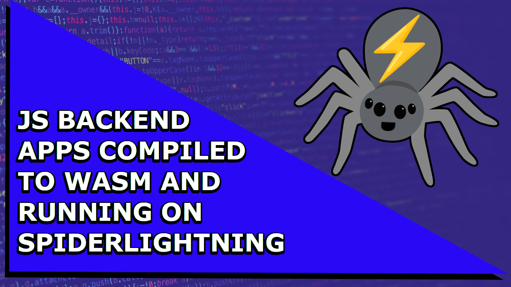

# slightjs

> 🔔: SlightJS has been merged upstream onto [SpiderLightning/`slight`](https://github.com/deislabs/spiderlightning). For intructions on how to use it in `slight`, please see [this](https://github.com/deislabs/spiderlightning#js)

This is an experimental project to make it possible to write JavaScript guest applications that make use of SpiderLightning capabilities.

It is comprised of:
- an `engine/`, which pre-initializes Wasm and injects slight dependencies into the JS context (i.e., w/ `quickjs-wasm-rs`), and
- a `cli/`, which inits the pre-initialized Wasm w/ actual guest code by passing it to the engine through `stdin`.

To try it out yourself, you can do: 
```bash
make keyvalue-all-in-one
```

Here's a video demo: 
[](https://youtu.be/dTyx3UTJdUI)
> The examples in this demo are run with slight v0.5.0.

## Installation

### UNIX

```sh
/bin/bash -c "$(curl -fsSL https://raw.githubusercontent.com/danbugs/slightjs/main/install.sh)"
```

### Windows

```sh
iex ((New-Object System.Net.WebClient).DownloadString('https://raw.githubusercontent.com/danbugs/slightjs/main/install.ps1'))
```

## Engine Download

### UNIX

```sh
curl https://raw.githubusercontent.com/danbugs/slightjs/main/slightjs_engine.wasm --output slightjs_engine.wasm
```

### Windows

```sh
curl https://raw.githubusercontent.com/danbugs/slightjs/main/slightjs_engine.wasm -O slightjs_engine.wasm
```